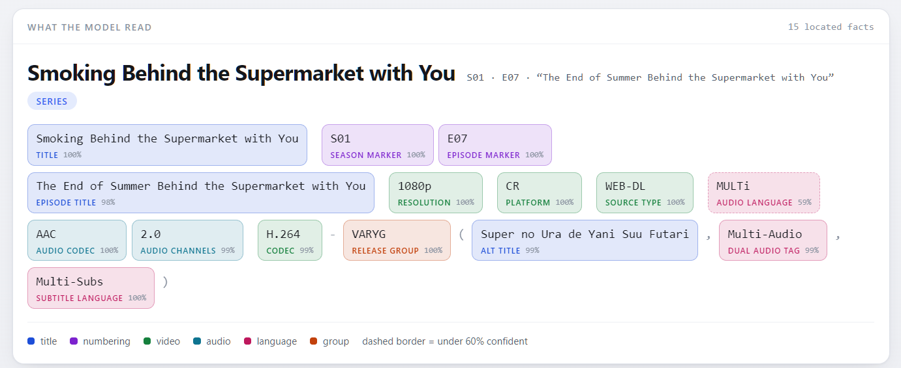

# NeuRelease

**A fast neural parser for torrent and release names.**

[](https://github.com/bonejay/neurelease/actions/workflows/build.yml)

[](LICENSE)
[](https://neurelease-demo.vercel.app)

NeuRelease is a fast, high-performance, multilingual neural parser for torrent and release names.
It reads a name, extracts its fields - title, season and episode, year, quality, codecs, languages,
release group and more - and classifies what the name is: a film, a series, music, a game,
software, a book, and whether it is anime. Every value comes with a confidence score and the span
it was read from.

It combines a character-level CNN with a Transformer encoder, running as int8 inference with
runtime-dispatched SIMD kernels, behind C++, C and Python APIs. No ML runtime; nothing to download.

[](https://neurelease-demo.vercel.app)

Fifteen fields read out of one name, each shown against the characters it came from.
[Try it in the browser](https://neurelease-demo.vercel.app).

Pattern-based parsers recognise known markers and guess the rest by position, so anything
ambiguous - a number that may be a year or an episode, a word that may be a language or part of
the title - is settled the same way every time, right or wrong. NeuRelease decides from context. It
is trained on hundreds of thousands of real, labelled release names from a large torrent index -
mostly English, with German, Spanish, French, Italian, Russian, Chinese and Japanese names as well.
It is about 3.4× faster than GuessIt on one thread, ~10× in batch, and should come out ahead on most
real-world names.

## Use

```python
from neurelease import Parser

parser = Parser()
r = parser.parse("Ted.Lasso.S03E03.4-5-1.1080p.ATVP.WEB-DL.DDP5.1.H.264-NTb")

r.title                                # 'Ted Lasso'
r.season, r.episode, r.episode_title   # 3, 3, '4-5-1'
r.streaming_service, r.release_group   # 'ATVP', ('NTb',)
r.source == "WEB-DL"                   # True: enums equal their labels
r.year                                 # None: the name does not say
r.title.confidence, r.episode_title.confidence  # 1.00, 0.80: every value knows how sure the model was
r.to_dict()                            # {'title': 'Ted Lasso', 'season': 3, 'episode': 3, ...}

names = ["Blade.Runner.2049.2017.2160p.UHD.BluRay.x265-TERMiNAL.mkv",
         "Stray_v1.5-Razor1911",
         "La Casa de Papel - Temporada 3 [HDTV 720p][Cap.305][AC3 5.1 Castellano]",
         "【高清剧集网 www.BTHDTV.com】邻家哥哥给我爱[第05-06集][简繁英字幕].Brother.Next.Door.2024.S01E05-06.1080p.WEB-DL.H264.AAC-BTHDTV",
         "葬送のフリーレン 第28話 「また会ったときに恥ずかしいからね」 (1080p).mkv",
         "Blade.Runner.1982.Final.Cut.REPACK.2160p.UHD.BluRay.DV.HDR.TrueHD.7.1-FraMeSToR"]
releases = parser.parse_batch(names)   # one result per name, in order

# Editions, revisions and the flags a name states about ITSELF rather than its content.
r = parser.parse("Dune.Part.Two.2024.PROPER.REPACK.2160p.UHD.BluRay.REMUX.DV.HDR.TrueHD.7.1-FraMeSToR")
r.proper, r.repack                     # True, True
r.release_version                      # 2: a proper or a repack IS the second version
r.remux, r.hdr                         # True, 'DV'
r.to_dict()["other"]                   # ['Proper', 'Repack', 'Remux', 'HDR10', 'Dolby Vision']

r = parser.parse("The.Wire.S01E01.INTERNAL.RESTORED.1080p.BluRay.x265-SARTRE")
r.edition                              # ('Internal', 'Restored'): a release is often several

SHOW = ("title", "alternative_title", "season", "episode", "absolute_episode",
        "episode_title", "year", "content", "edition", "version")
for r in releases:
    d = r.to_dict()
    print({k: d[k] for k in SHOW if d.get(k) is not None})
# {'title': 'Blade Runner 2049', 'year': 2017, 'content': 'movie'}
# {'title': 'Stray', 'content': 'game'}
# {'title': 'La Casa de Papel', 'season': 3, 'episode': 5, 'content': 'series'}
# {'title': 'Brother Next Door', 'alternative_title': '邻家哥哥给我爱', 'season': 1, 'episode': [5, 6], 'year': 2024, 'content': 'series'}
# {'title': '葬送のフリーレン', 'absolute_episode': 28, 'episode_title': 'また会ったときに恥ずかしいからね', 'content': 'series'}
# {'title': 'Blade Runner', 'year': 1982, 'content': 'movie', 'edition': 'Final Cut', 'version': 2}
```

```sh
pip install neurelease
```

The [wheel](https://pypi.org/project/neurelease/) bundles the library and the model.
`parse_batch` runs many names at once on several threads and returns them in input order. Titles
and evidence keep their original script - Latin, Han, Kana, Cyrillic.

- [docs/API.md](docs/API.md) - the C++ and C APIs
- [docs/RESULT.md](docs/RESULT.md) - every field a result can carry
- [docs/ARCHITECTURE.md](docs/ARCHITECTURE.md#build) - building from source

## Compared with GuessIt, Sonarr and Radarr

Measured on 2026-09-22 with the shipped model (version 5). Every figure is the share of names
answered completely correctly - every field the name states read right, nothing invented. One
wrong field fails the name.

Sonarr answers only series and Radarr only films, and they model 16 and 14 fields against 29 here,
so the table is split by content kind and scored only on the nine fields all four answer:
`work_title`, `year`, `resolution`, `source_family`, `release_group`, `release_variant`,
`audio_language`, `subtitle_language`, `crc32`. Our hard sets keep at most three names per
franchise.

| | cases | NeuRelease | GuessIt | Radarr | Sonarr |
|---|---:|---:|---:|---:|---:|
| **our labelled names** | | | | | |
| representative, films | 1,001 | **93.5%** | 78.0% | 69.7% | 2.5% |
| representative, series | 2,075 | **96.0%** | 60.9% | 8.1% | 65.5% |
| hard, films | 1,037 | **54.1%** | 30.1% | 36.1% | 1.4% |
| hard, series | 915 | **79.2%** | 42.2% | 5.8% | 55.0% |
| **each parser's own suite** | | | | | |
| GuessIt's corpus, films | 194 | 88.7% | **95.4%** | 49.5% | 2.1% |
| GuessIt's corpus, series | 461 | 85.5% | **94.4%** | 7.2% | 57.3% |
| Sonarr's suite, series | 935 | 91.0% | 80.7% | 45.0% | **95.2%** |
| Radarr's suite, films | 535 | 88.0% | 76.8% | **98.5%** | 68.8% |

The lower half is each parser's own regression suite: strings written to pin its own regexes down,
which is why every parser wins its own and why those wins say little about real names. NeuRelease
is second on all three, having trained on none of them. GuessIt's suite is scored on 859 of its
1,048 entries - the rest are filesystem paths, `type` assertions inherited from file defaults, or
values our closed vocabulary cannot express, all listed in the full report. Sonarr's and Radarr's
suites run almost unfiltered.

On the full twenty-field contract, video names, our validation split: **97.88% macro field F1 and
91.54% exact** against GuessIt's 86.74% and 52.96%. About **3x faster on one thread**
(2,793 us/name against 8,275), 949 us/name in batch on four threads.

Name-by-name: [docs/ANIME.md](docs/ANIME.md), [docs/LIVE_ACTION.md](docs/LIVE_ACTION.md).
Method and reproduction: [docs/GUESSIT_COMPARISON.md](docs/GUESSIT_COMPARISON.md).
Timings: [docs/ARCHITECTURE.md](docs/ARCHITECTURE.md).

## Documentation

| | |
|---|---|
| [docs/API.md](docs/API.md) | Python, C++ and C usage |
| [docs/RESULT.md](docs/RESULT.md) | Every result field and its conventions |
| [docs/ARCHITECTURE.md](docs/ARCHITECTURE.md) | Model, conversion layer, performance, building from source, model versions |
| [docs/C_ABI.md](docs/C_ABI.md) | The C binary interface |
| [docs/GUESSIT_COMPARISON.md](docs/GUESSIT_COMPARISON.md) | Method and per-field numbers of the GuessIt comparison |
| [docs/ANIME.md](docs/ANIME.md) | The anime verdict, and five anime names read by both parsers |
| [docs/LIVE_ACTION.md](docs/LIVE_ACTION.md) | Fourteen live-action names, in four languages, read by both parsers |

## License

[MIT](LICENSE).

PCRE2 is statically linked into the library and travels inside every binary this project
distributes, including the Python wheels; its licence is in
[THIRD_PARTY_NOTICES.md](THIRD_PARTY_NOTICES.md).
